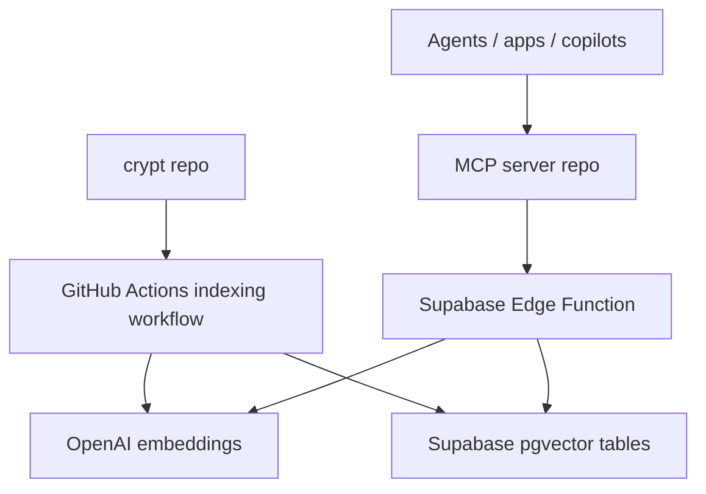

# Semantic Search Stack Spec

This note defines the recommended three-layer architecture for semantic search and retrieval-augmented generation across the vault:

1. the `crypt` repo as the source-of-truth content and indexing pipeline
2. a Supabase Edge Function as the hosted retrieval API
3. a separate MCP server repo as the agent-facing tool layer

The goal is to keep content/indexing concerns separate from runtime retrieval and separate again from agent orchestration.

## Why This Split

The `crypt` repo is the right place for content and ingestion, but not the right long-term home for a reusable runtime search service. If retrieval logic lives here, the content repo gradually turns into an application repo. If every agent talks directly to Supabase, we duplicate retrieval behavior and expose too much implementation detail.

This architecture avoids both problems:

- `crypt` owns documents, chunking, indexing, and persistence
- Supabase Edge Functions own query execution and retrieval policy
- the MCP server owns agent tools, orchestration, and future multi-tool workflows

## System Overview



## Layer 1: `crypt` Repo Spec

This repo should remain the source of truth for content and indexing only.

### Responsibilities

- store vault content
- define which file types are indexable
- normalize Markdown, JSON, and canvas files
- chunk content into embedding-safe slices
- generate embeddings during indexing
- write chunks and metadata to Supabase
- keep the vector store synchronized on push

### Assets already in this repo

- root vault entry point: `README.md`
- indexer code: `tools/vault-indexer/`
- GitHub Actions workflow: `.github/workflows/index-vault.yml`
- Supabase migration: `supabase/migrations/20260311110000_create_vault_index.sql`
- planning notes:
  - `Projects/Semantic Search and Agent RAG.md`
  - `Projects/Semantic Search Stack Spec.md`

### Public contract from this repo

This repo effectively publishes the following data contract into Supabase:

#### `public.vault_chunks`

- `id`
- `repo_path`
- `source_type`
- `title`
- `heading_path`
- `chunk_index`
- `content`
- `content_hash`
- `embedding`
- `metadata`
- `git_commit_sha`
- `last_indexed_at`

#### `public.vault_sources`

- `repo_path`
- `source_hash`
- `last_seen_commit`
- `last_indexed_at`
- `status`

#### Retrieval RPC

- `public.match_vault_chunks(query_embedding, match_count, filter)`

### Boundaries for this repo

This repo should not become the home for:

- HTTP retrieval endpoints
- long-lived query services
- agent orchestration tools
- session-aware chat or answer generation APIs
- external app auth and authorization rules for retrieval consumers

### Operational expectations

- push to `main` performs incremental indexing
- manual workflow run performs a full reindex
- Supabase remains the durable storage layer
- OpenAI is used only for embedding generation in the indexing job

### Future changes that still belong here

- adding support for more source types
- improving chunking heuristics
- improving metadata extraction
- changing include/exclude rules
- moving to a different embedding model and reindexing

## Layer 2: Supabase Edge Function Spec

The Edge Function should be the first production retrieval runtime.

### Why Edge Functions first

- close to the data
- easy to host without a separate app server
- natural place for a small retrieval API
- can centralize search behavior for apps and agents
- keeps service-role access off clients and agents

### Function responsibilities

- accept retrieval requests
- embed the incoming user query
- call `public.match_vault_chunks(...)`
- post-process results
- apply path and source filters
- dedupe and trim context
- return a clean response object for clients and agents

### Function name

Recommended initial function name:

- `search-vault`

Optional follow-on functions:

- `search-vault-debug`
- `answer-vault-question`
- `summarize-vault-sources`

### Request contract

Recommended request body:

```json
{
  "query": "How does Basilisk map ritual state to AV output?",
  "repo_path_prefix": "Projects/Basilisk SH",
  "source_type": "markdown",
  "match_count": 8,
  "min_similarity": 0.65,
  "max_per_source": 2
}
```

Required fields:

- `query`

Optional fields:

- `repo_path_prefix`
- `source_type`
- `match_count`
- `min_similarity`
- `max_per_source`
- `include_content`

### Response contract

Recommended response:

```json
{
  "query": "How does Basilisk map ritual state to AV output?",
  "results": [
    {
      "repo_path": "Projects/Basilisk SH/docs/systems/ritual-state-and-score.md",
      "title": "Ritual state and score",
      "heading_path": ["State mapping"],
      "content": "...",
      "similarity": 0.89,
      "metadata": {
        "type": "doc"
      }
    }
  ],
  "meta": {
    "match_count": 8,
    "returned": 5,
    "repo_path_prefix": "Projects/Basilisk SH"
  }
}
```

### Internal function flow

1. validate request body
2. embed the query with the same embedding family used for indexing
3. call `match_vault_chunks(...)`
4. filter out low-similarity results
5. cap repeated chunks from the same source
6. optionally trim content lengths
7. return structured results

### Edge Function environment

Expected secrets/config:

- `OPENAI_API_KEY`
- `OPENAI_EMBED_MODEL`
- `SUPABASE_URL`
- `SUPABASE_SERVICE_ROLE_KEY` or a secure server-side Supabase client path

### Security model

Recommended v1:

- function is server-side only
- require either:
  - a private bearer token for trusted callers
  - or Supabase auth if you already have authenticated app users

Do not expose direct database credentials to agents or browser clients.

### Retrieval policy defaults

Recommended defaults:

- `match_count`: `8`
- `min_similarity`: `0.65`
- `max_per_source`: `2`
- prefer multiple distinct sources over many adjacent chunks from one file

### Edge Function non-goals

The first function should not:

- answer questions directly
- rewrite prompts for the agent
- decide user intent
- manage conversations
- become the full MCP layer

It is a retrieval service, not an agent.

## Layer 3: MCP Server Spec

The MCP server should live in its own repo and sit above the Edge Function.

### Why separate repo

- cleaner deployment lifecycle
- independent agent/tool versioning
- easier to add more tools later
- no need to couple agent logic to vault content commits
- simpler testing for tool behaviors

### MCP server responsibilities

- expose retrieval to agents as one or more tools
- call the Edge Function, not Supabase directly
- normalize responses into agent-friendly output
- add future tools beyond semantic search
- manage higher-level behaviors such as compare, summarize, or plan-from-docs

### Recommended first repo shape

```text
vault-mcp/
  README.md
  package.json
  src/
    server.ts
    tools/
      searchVault.ts
      searchBasilisk.ts
      searchCooking.ts
    lib/
      edgeClient.ts
      schemas.ts
      formatters.ts
  test/
```

### Recommended first MCP tools

#### `search_vault`

Use for general vault semantic retrieval.

Inputs:

- `query`
- optional `repo_path_prefix`
- optional `match_count`

Outputs:

- ranked chunks
- paths
- headings
- similarity scores

#### `search_basilisk`

Same as `search_vault`, but hard-scoped to `Projects/Basilisk SH`.

#### `search_cooking`

Same as `search_vault`, but hard-scoped to `Cooking`.

### Second-wave MCP tools

Once the first search tool is stable, add:

- `summarize_sources`
- `compare_sources`
- `plan_from_docs`
- `answer_with_citations`

These should all reuse the same retrieval client and evidence formatting helpers.

### MCP server data flow

1. agent calls MCP tool
2. MCP tool validates input
3. MCP server calls Supabase Edge Function
4. Edge Function performs embedding + search
5. MCP server reformats results for the agent
6. agent answers with citations or uses results for planning

### MCP response principles

- always return source paths
- keep raw content available when helpful
- do not hide similarity or source metadata
- prefer explicit evidence over opaque “trust me” summaries

## RAG Introduction Strategy

Do not jump straight from vector storage to a fully autonomous RAG system. Add the pieces in a stable order.

### Stage 1: Retrieval only

Goal:

- prove search quality
- verify filters and relevance
- inspect returned chunks manually

Deliverable:

- Edge Function + MCP search tool

### Stage 2: Citation-first synthesis

Goal:

- let an app or agent answer from retrieved evidence

Deliverable:

- answer layer that consumes retrieval results
- mandatory citations

### Stage 3: Workflow-aware agent use

Goal:

- use retrieval inside planning, documentation, or domain assistants

Deliverable:

- scoped agent tools for Basilisk and Cooking

### Stage 4: Full RAG

Goal:

- combine retrieval, context assembly, and answer generation reliably

Deliverable:

- reusable answer service or MCP tool with guardrails

## Suggested Build Order

### Build now in `crypt`

- maintain the indexing pipeline
- keep chunking safe
- keep README/docs accurate

### Build next in Supabase

- `search-vault` Edge Function
- request validation
- query embedding
- result filtering and deduping

### Build after that in a new repo

- MCP server
- `search_vault`
- `search_basilisk`
- `search_cooking`

### Build after retrieval quality is proven

- a citation-first answer tool or service
- domain-specific agent flows

## Acceptance Criteria

### `crypt` repo layer

- pushes keep Supabase in sync
- full reruns can rebuild the full index
- chunking never exceeds embedding limits

### Edge Function layer

- query embedding works with the same model family as indexing
- filtered retrieval returns relevant chunks with citations
- clients never need direct database credentials

### MCP layer

- agents can search the vault with one tool call
- domain-scoped tools reduce irrelevant results
- outputs are citation-rich and predictable

## Recommended Next Implementation

The most practical next step is:

1. keep this repo as-is for indexing
2. build `search-vault` as a Supabase Edge Function
3. create a new repo for the MCP server that wraps the Edge Function

That path gives you the smallest possible production retrieval surface first, while keeping room for a much richer agent layer later.
